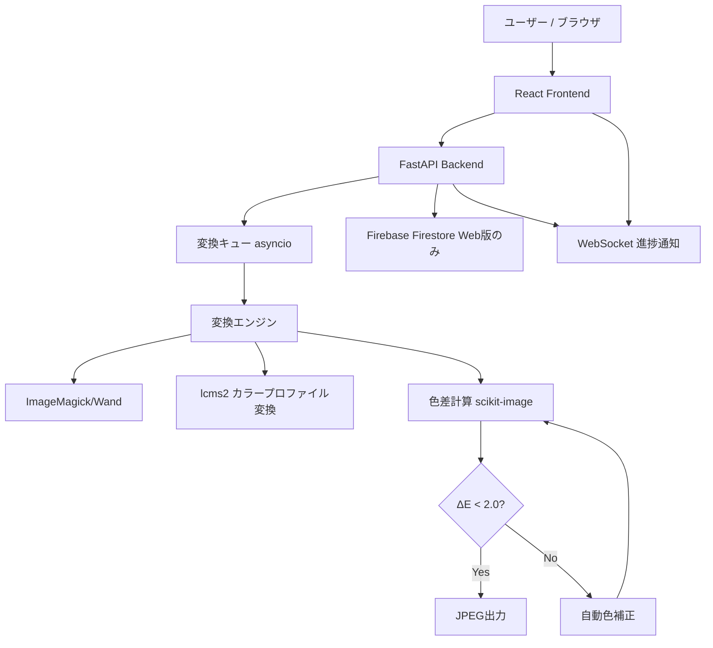

# Design Document

## Overview

`chroma-sync` は、ai/psdファイルからJPEGへの変換時に発生する色ずれを自動修正するWebアプリケーションです。フロントエンド（React）とバックエンド（FastAPI）の分離アーキテクチャを採用し、変換処理はImageMagick + lcms2エンジンが担当します。

## Steering Document Alignment

### Technical Standards (tech.md)
- Python 3.11 + FastAPI によるバックエンドAPIを実装
- React + TypeScript によるフロントエンドSPAを実装
- Docker Compose（compose.yaml）による環境管理
- lcms2 + ImageMagick による高精度カラープロファイル変換

### Project Structure (structure.md)
- バックエンド: `backend/` ディレクトリ
- フロントエンド: `frontend/` ディレクトリ
- 変換エンジン: `backend/app/converter/` モジュール

## Code Reuse Analysis

### Existing Components to Leverage
- **lcms2**: ICCプロファイル変換の業界標準ライブラリ（外部ライブラリ）
- **ImageMagick/Wand**: 画像変換の実績あるライブラリ（外部ライブラリ）
- **scikit-image**: 色差（ΔE）計算用（外部ライブラリ）

### Integration Points
- **Firebase Firestore**: 変換ログの保存（Web版のみ）
## Architecture

システム全体は以下のコンポーネントで構成されます：



### Modular Design Principles
- **変換エンジン**: UI・APIから完全に独立したPythonモジュール
- **APIレイヤー**: 変換エンジンを呼び出すビジネスロジック
- **UIレイヤー**: APIのみと通信し、変換ロジックを持たない

## Components and Interfaces

### ConversionEngine（変換エンジン）
- **Purpose:** ai/psdファイルをJPEGに変換し、色差を計算する
- **Interfaces:**
  - `convert(input_path, output_path, options) -> ConversionResult`
  - `calculate_color_diff(original_path, converted_path) -> float (ΔE)`
  - `apply_color_correction(image, reference_image) -> Image`
- **Dependencies:** ImageMagick (wand), lcms2, scikit-image
- **Reuses:** 外部ライブラリのみ

### ColorProfileManager（カラープロファイル管理）
- **Purpose:** ICCカラープロファイルの読み取りとsRGBへの変換
- **Interfaces:**
  - `get_icc_profile(file_path) -> ICCProfile`
  - `convert_to_srgb(image, source_profile) -> Image`
- **Dependencies:** lcms2, Wand
- **Reuses:** ConversionEngine から呼ばれる

### ColorDiffCalculator（色差計算）
- **Purpose:** CIEDE2000規格でΔEを計算し、色ずれ領域を特定する
- **Interfaces:**
  - `calculate_delta_e(image1, image2) -> float`
  - `get_diff_regions(image1, image2, threshold) -> List[Region]`
- **Dependencies:** scikit-image, numpy
- **Reuses:** ConversionEngine から呼ばれる

### ConversionAPI（FastAPI ルーター）
- **Purpose:** ファイルのアップロード受付・変換ジョブ管理・結果返却
- **Interfaces:**
  - `POST /api/convert` - ファイルアップロードと変換開始
  - `GET /api/convert/{job_id}/status` - 変換状態確認
  - `GET /api/convert/{job_id}/result` - 変換結果取得
  - `WebSocket /ws/{job_id}` - リアルタイム進捗通知
- **Dependencies:** FastAPI, ConversionEngine
- **Reuses:** ConversionEngine, ColorDiffCalculator

## Data Models

### ConversionJob
```python
class ConversionJob:
    job_id: str          # UUID
    status: str          # "pending" | "processing" | "completed" | "failed"
    input_file_path: str # アップロードされたファイルのパス
    output_file_path: str | None  # 変換後のJPEGパス
    options: ConversionOptions
    delta_e: float | None        # 最終的な色差値
    corrections_applied: bool    # 自動色補正が適用されたか
    created_at: datetime
    completed_at: datetime | None
    error: str | None
```

### ConversionOptions
```python
class ConversionOptions:
    target_size_kb: int | None   # 目標ファイルサイズ（KB）
    quality: int = 85            # JPEG品質 (1-100)
    max_delta_e: float = 2.0     # 許容する最大色差
```

### ConversionResult
```python
class ConversionResult:
    job_id: str
    success: bool
    output_path: str | None
    original_size_bytes: int
    output_size_bytes: int
    delta_e: float              # 最終ΔE値
    corrections_applied: bool
    correction_regions: List[Region]  # 修正された領域情報
```

## Error Handling

### Error Scenarios

1. **未対応ファイル形式のアップロード**
   - **Handling:** ファイルのMIMEタイプと拡張子を検証し、非対応の場合は422エラーを返す
   - **User Impact:** 「このファイル形式は対応していません」メッセージを表示

2. **変換処理中のメモリ不足**
   - **Handling:** `MemoryError` をキャッチし、ジョブを `failed` 状態に変更
   - **User Impact:** 「ファイルサイズが大きすぎます。100MB以下のファイルをご使用ください」を表示

3. **色差が閾値を超え、自動修正でも改善不可能**
   - **Handling:** 最大修正試行回数（3回）を超えた場合は警告付きで変換結果を返す
   - **User Impact:** 「色補正の精度が目標値に達しませんでした（ΔE: X.X）」と色差マップを表示

## Testing Strategy

### Unit Testing
- 各モジュール（ConversionEngine, ColorProfileManager, ColorDiffCalculator）の単体テスト
- テストデータ: 代表的なai/psdファイルのサンプルセット
- pytest + pytest-asyncio を使用

### Integration Testing
- APIエンドポイントの統合テスト（ファイルアップロード〜変換完了のフロー）
- 色差計算の精度テスト（既知の色差値を持つテスト画像で検証）

### End-to-End Testing
- 実際のai/psdファイルを使った変換テスト
- 色差がΔE < 2.0 以内に収まることの確認
- バッチ変換の動作確認
